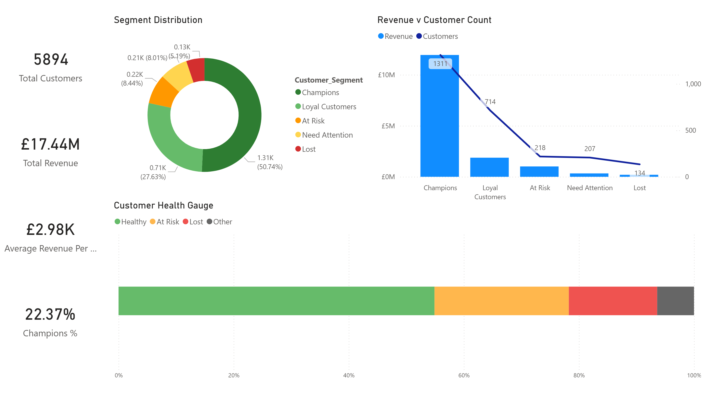
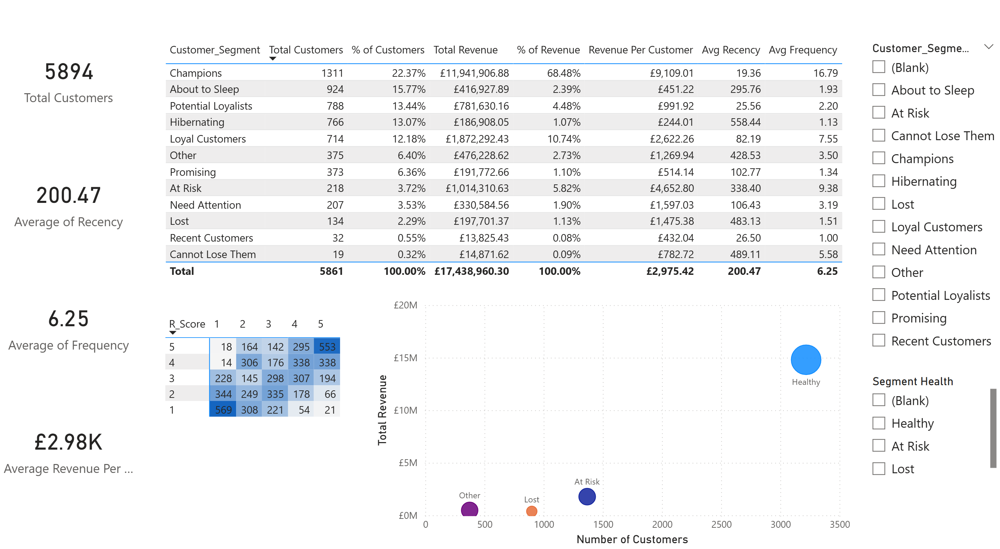

# RFM Customer Segmentation Analysis

End-to-end customer segmentation project using RFM (Recency, Frequency, Monetary) analysis to identify high-value customers and enable targeted marketing strategies.



## Project Overview

This project demonstrates a complete data analytics workflow:
- Data cleaning and transformation in SQL Server
- RFM scoring using NTILE window functions
- Customer segmentation using CASE logic
- Interactive Power BI dashboard
- Actionable business insights and recommendations

## Business Problem

A UK-based online retailer needed to:
- Identify their most valuable customers
- Understand customer purchase behavior patterns
- Segment customers for targeted marketing campaigns
- Reduce customer churn through proactive engagement

## Key Insights

- **54.9% of customers** are in "Healthy" segments (Champions, Loyal, Potential Loyalists)
- **Champions** (22.4% of customers) drive **68.5% of total revenue**
- **At Risk** segment represents **~£1M in annual revenue** requiring urgent win-back campaigns
- Average revenue per customer: **£2,975.42**
- Identified **234 high-value customers** at risk of churning

## Technologies Used

- **SQL Server** - Data warehousing, ETL, and RFM calculation
- **T-SQL** - Window functions (NTILE), CTEs, CASE statements
- **Power BI** - Interactive dashboards and visualizations
- **DAX** - Custom measures and calculated columns
- **Git/GitHub** - Version control and portfolio hosting

## Project Structure
```
rfm-customer-segmentation/
├── sql/
│   ├── 01_data_cleaning.sql          # Data quality and validation
│   ├── 02_rfm_calculation.sql        # RFM metrics calculation
│   └── 03_customer_segmentation.sql  # Segmentation logic
├── dashboard/
│   ├── RFM_Dashboard.pbix            # Power BI dashboard
│   └── screenshots/                  # Dashboard visuals
├── data/
│   └── README.md                     # Data source info
└── README.md
```

## 📈 Methodology

### 1. Data Cleaning
- Removed 247,372 rows with NULL CustomerIDs (23.1% of raw data)
- Filtered out non-product transactions (POST, BANK CHARGES, etc.)
- Handled cancellations (InvoiceNo prefix 'C')
- **Final dataset:** 820,000 transactions from 5,849 customers

### 2. RFM Calculation
Used `NTILE(5)` window functions to score customers 1-5 on three dimensions:

- **Recency (R):** Days since last purchase
  - Score 5 = Most recent (< 30 days)
  - Score 1 = Least recent (> 250 days)

- **Frequency (F):** Number of transactions
  - Score 5 = High frequency (20+ orders)
  - Score 1 = Low frequency (1-2 orders)

- **Monetary (M):** Total lifetime spend
  - Score 5 = High value (£5,000+)
  - Score 1 = Low value (< £500)

### 3. Customer Segmentation
Created 11 distinct segments using RFM score combinations:

| Segment | RFM Criteria | Description |
|---------|-------------|-------------|
| **Champions** | R≥4, F≥4, M≥4 | Best customers - recent, frequent, high-spend |
| **Loyal Customers** | R≥3, F≥4 | Regular buyers with consistent engagement |
| **Potential Loyalists** | R≥4, F=2-3 | Recent customers showing growth potential |
| **At Risk** | R≤2, F≥4, M≥4 | High-value customers going dormant |
| **Cannot Lose Them** | R≤1, F≥4 | Best customers who haven't purchased recently |
| **About to Sleep** | R=2-3, F≤3, M≤3 | Mediocre customers fading away |
| **Hibernating** | R≤2, F≤2, M≤2 | Long-dormant, low-value customers |
| **Lost** | R≤2, F≤2 | Churned customers |
| **Recent Customers** | R≥4, F≤2 | New customers, low frequency |
| **Promising** | R=3-4, F≤2 | Recent but infrequent, needs nurturing |
| **Need Attention** | R≥3, F≥3, M≥3 | Above average but slipping |

## 📊 Dashboard Features

### Page 1: Executive Summary
- **Customer Health Gauge:** Visual breakdown of Healthy (55%), At Risk (23%), Lost (15%)
- **Key Metrics Cards:** Total Customers, Revenue, Avg Revenue/Customer, Champions %
- **100% Stacked Bar:** Segment distribution with clear color coding

### Page 2: Segment Analysis
- **Performance Table:** Detailed metrics by segment (customers, revenue, averages)
- **RFM Heat Map:** Visual matrix showing customer concentration across R×F scores
- **Scatter Plot:** Revenue vs Customer Count (bubble size = value per customer)




## 🔧 Technical Highlights

- **SQL Optimization:** Used CTEs and window functions for efficient calculation on 400K+ row dataset
- **Data Quality:** Implemented comprehensive cleaning rules reducing dataset by 27% for accuracy
- **Scalability:** Modular SQL scripts can be automated for monthly/weekly RFM refresh
- **Visualization Best Practices:** Color-coded segments (green=healthy, orange=risk, red=lost) for instant insights
- **Business Context:** Every metric tied to actionable recommendation, not just reporting

## 🔄 Future Enhancements

- [ ] Automate RFM recalculation with SQL Server Agent (monthly refresh)
- [ ] Build predictive churn model using Python (sklearn, XGBoost)
- [ ] Integrate with CRM system for automated campaign triggering
- [ ] Add cohort analysis to track segment movement over time
- [ ] Create customer lifetime value (CLV) predictions

## 📫 Contact

**Sherif Ejiwunmi**  
Data Analyst | SQL • Python • Power BI  
Manchester, UK

## 📄 Data Source

Dataset: [UCI Online Retail Dataset](https://archive.ics.uci.edu/ml/datasets/Online+Retail)  
License: Open for educational and research purposes

---

*This project showcases end-to-end data analytics: from raw data cleaning through SQL transformation to actionable business insights via interactive dashboards.*

**Last Updated:** March 2026